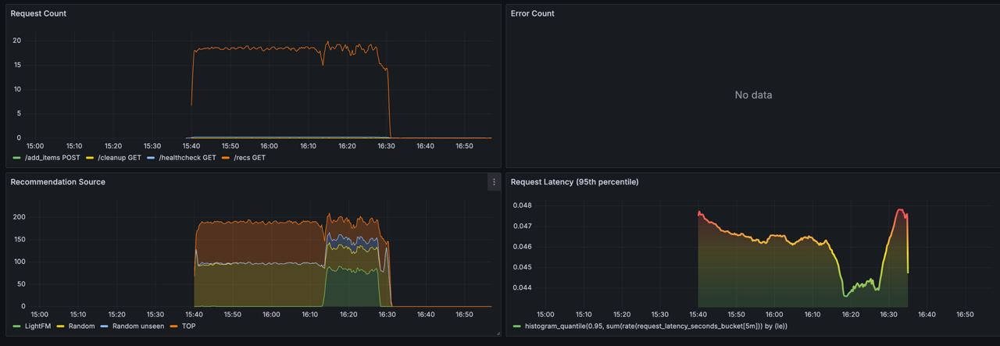

# Recommendation service

## Description
Service for collecting user likes/dislikes and returning recommendations based on this data.
`/interact` - gives like/dislike to item for user
`/add_items` - adss new items to recommendations
`/recs/{user_id}` - asks for recommendations for user

## Starting project

1. Install docker, docker compose
2. From root of project `docker compose up --build -d` 
3. Adter build docker will create containers and start them
```
  ✔ Network recommendation_system_default                     Created                                                                                                                                                                                            0.1s
 ✔ Container recommendation_system-prometheus-1              Started                                                                                                                                                                                            0.1s
 ✔ Container recommendation_system-rabbitmq-1                Healthy                                                                                                                                                                                            0.1s
 ✔ Container recommendation_system-redis-1                   Healthy                                                                                                                                                                                            0.1s
 ✔ Container recommendation_system-grafana-1                 Started                                                                                                                                                                                            0.1s
 ✔ Container recommendation_system-recommendation_service-1  Started                                                                                                                                                                                            0.1s
 ✔ Container recommendation_system-event_collector-1         Started                                                                                                                                                                                            0.1s
 ✔ Container recommendation_system-regular_pipeline-1        Started
 ```

# Structure
* event_collector - service for collecting calls to `/interact` - likes/dislikes of items for user and saving them to rabbitmq
* regular_pipeline - once in 10 seconds reads data from rabibtimq and writes them to INTERACTIONS_FILE
    * recs.py - main script that reads interactions, calculates recomendations and writes them to redis so later they could be returned to user
* recommendations 
    * `/healthcheck` checks that all services are up
    * `/cleanup` cleans up all data for fresh start
    * `/add_items` adds new objects to recomendations
    * `/recs/{user_id}` reads recommendations from redis if there is no recs - return random items 
* grafana - metrics of the system open http://localhost:3000/ default user/pass admin/admin

# Example of working service



Here we first return random + top items while accumulating data for new users. Then we return LightFM recommendations based on recorded data when users return to service if we don't have recs then it's random + top items again. Also we add a small percentage of unseen items to recommendations to explore potential likes of user.
